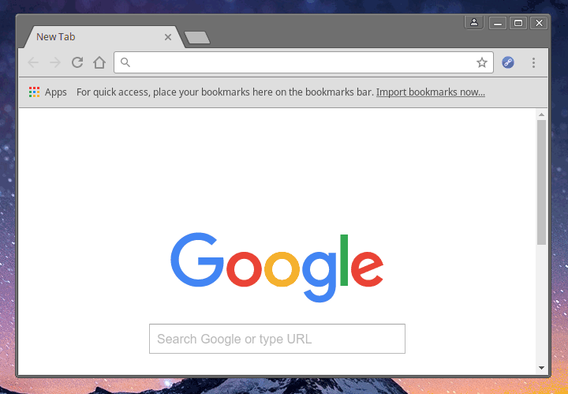

### Mark As Read

Chrome extension based on [Mark All As Read](https://github.com/imkevinxu/mark-all-as-read) that adds the main links from news aggregator websites to the web browser history, consequently applying the _":visited"_ state and _(depending on the design of the website)_ changing their color for easy recognition that they were already viewed.

The original project has an interesting behavior, it pushes all links in the page to the browser history without any special reasoning. Google Chrome stores the history in a SQlite database that is locked while the browser is running and that after certain amount of data starts making the navigation slow. This fork aims to ease the amount of URLs pushed to the history to reduce the consumption, for instance, visiting the front page of Reddit without an open session forces the original project to push more than two hundred links to the history, while this version pushes only the main twenty-five links.



### Support

The list of supported websites is limited due to the way this version of the extension filters the important links from the active page. To differentiate from main and normal links this extension compares the associated CSS class names, for example, Reddit associates the CSS class name _"title"_ to the HTML anchor tags pointing to their content:

- [x] https://www.reddit.com/
- [x] https://www.craigslist.org/
- [x] https://news.ycombinator.com/
- [x] https://www.designernews.co/

### License

```
The MIT License (MIT)

Copyright (c) 2016 CIXTOR

Permission is hereby granted, free of charge, to any person obtaining a copy
of this software and associated documentation files (the "Software"), to deal
in the Software without restriction, including without limitation the rights
to use, copy, modify, merge, publish, distribute, sublicense, and/or sell
copies of the Software, and to permit persons to whom the Software is
furnished to do so, subject to the following conditions:

The above copyright notice and this permission notice shall be included in all
copies or substantial portions of the Software.

THE SOFTWARE IS PROVIDED "AS IS", WITHOUT WARRANTY OF ANY KIND, EXPRESS OR
IMPLIED, INCLUDING BUT NOT LIMITED TO THE WARRANTIES OF MERCHANTABILITY,
FITNESS FOR A PARTICULAR PURPOSE AND NONINFRINGEMENT. IN NO EVENT SHALL THE
AUTHORS OR COPYRIGHT HOLDERS BE LIABLE FOR ANY CLAIM, DAMAGES OR OTHER
LIABILITY, WHETHER IN AN ACTION OF CONTRACT, TORT OR OTHERWISE, ARISING FROM,
OUT OF OR IN CONNECTION WITH THE SOFTWARE OR THE USE OR OTHER DEALINGS IN THE
SOFTWARE.
```
